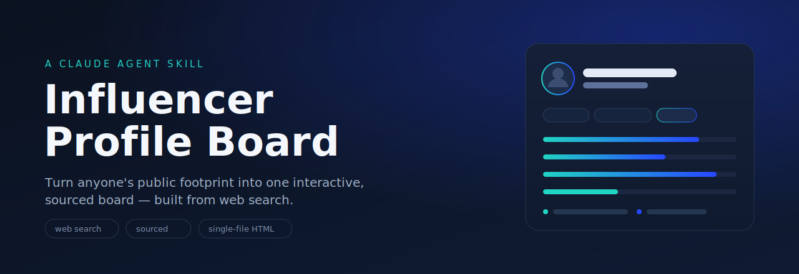

<p align="center">
  
</p>

<p align="center"><em>Turn anyone's public footprint into one interactive, sourced board — the same way every time.</em></p>

<p align="center">
  
  
  
  
</p>

---

# Influencer Profile Board — a Claude Agent Skill

A Claude [Agent Skill](https://support.claude.com/en/articles/12512180-use-skills-in-claude) that turns a person's **public** footprint into a single, polished, interactive HTML board: who they are, how to reach them, what they're known for, the links worth keeping, the standout facts, and — optionally — how legible they are to an LLM.

The point of the skill is that the research questions, the board structure, and the privacy rules are **settled in advance**, so every profile comes out complete, accurate, and the same shape — instead of improvised each time.

> Profiles are built from **public information** and are **sourced**. This is a snapshot of a public footprint, not a background check.

## What this skill is

Ask Claude about a creator, expert, founder, or public personality — *"tell me about [name]"*, *"build a profile of [name]"*, *"make an influencer board"* — and it runs a focused web-search sweep, structures what it finds, and renders an interactive board you can open, screenshot, or share. It's **instructions only**: no executable code, no stored credentials.

## What it's for

1. **One question, a complete profile.** Instead of ten tabs and a scratch doc, you get one board that already covers identity, contact, expertise, work, trajectory, and highlights.
2. **Built from public sources, with receipts.** Every board ends with the links it was built from and an "as of" date, so it's easy to trust and easy to check.
3. **Consistent and shareable.** Every profile comes out in the same clean, responsive shape — good for a quick brief, outreach prep, a speaker bio, or a competitive scan.

## Functions

- **Subject resolution** — pins down *which* person (handles look-alikes and same-name collisions) before researching.
- **Public-signal sweep** — targeted web searches for identity, contact/channels, social presence, expertise, notable work, trajectory, and key facts.
- **Social presence & audience size** — lists the platforms the person is active on with a follower/subscriber count per platform, shown as approximate and dated.
- **Footprint calibration** — a fuller board for well-documented figures, a compact one for thin/emerging presences (no padding).
- **Analytical tone** — neutral, factual presentation; no praise, hype, or emotional framing.
- **Interactive board render** — a self-contained HTML file with topic filters, copy buttons, and section nav.
- **Live AI-search visibility (optional)** — when the **SE Ranking** connector/API is available, enrich the board with real data on how the person shows up when users ask about them in **ChatGPT** and **Google AI Overviews / AI Mode**.
- **Graceful fallback** — if SE Ranking isn't connected, or its credits run out, the skill drops just that section and builds the standard web-search board. SE Ranking is never required for a result.
- **Optional LLM-visibility read** — a five-dimension heuristic score (Identity, Topic Association, Trust/Corroboration, Freshness & Trajectory, Risk) describing how legible the person is to a model.
- **Sourcing & privacy discipline** — public info only, corroborated, dated, with a sources list.

## Who it's for, and the tasks it handles

**Marketers & founders** prepping outreach or partnerships
- Build a one-screen brief on a creator or expert before a call or pitch.
- Map someone's expertise and notable work without ten open tabs.

**Community & events teams**
- Assemble a clean speaker/guest profile with links and highlights.
- Disambiguate similarly-named people in the same field.

**GEO / AI-visibility specialists**
- Add the optional LLM-visibility read to see how clearly a model can "place" a person.
- Spot name-collision and freshness risks that muddy how LLMs represent someone.

**Anyone doing people research**
- Turn scattered public info into one shareable, sourced board.

### Example prompts

- "Build a profile board for [name]."
- "Tell me about [creator] — make it a board I can share."
- "Make an influencer board for [name], and include the LLM-visibility read."
- "Profile [name] from [niche] — who are they and what are they known for?"

You don't have to name the skill — Claude triggers it from the task. Its first step is to make sure it's profiling the right person.

## How it works

1. **Pin down the subject** — name + niche/handle; resolve same-name collisions; stop if there's no real public presence.
2. **Gather public signals** — several targeted web searches to fill every section, preferring primary/official sources and corroborating non-official claims.
3. **(Optional) Live AI-search via SE Ranking** — if the connector is available, pull how the person shows up in ChatGPT and Google AI Overviews / AI Mode (mentions, citations, the prompts people ask). Skips cleanly if SE Ranking is absent or out of credits.
4. **Structure the data** — into the board schema; calibrate richness to the footprint; add a name-note where confusion is likely.
5. **(Optional) LLM-visibility read** — the five-dimension heuristic score, included only when useful or requested.
6. **Render the board** — one self-contained interactive HTML file, ending with sources and an "as of" date.

Full detail lives in [`influencer-profile-board/SKILL.md`](influencer-profile-board/SKILL.md), with the section schema in `references/board-spec.md`, the layout/design tokens in `references/board-template.md`, and the SE Ranking enrichment steps in `references/se-ranking-ai-search.md`.

### Two modes, one output

| | Web search only | + SE Ranking connected |
|---|---|---|
| Identity, contact, expertise, work, highlights | ✅ | ✅ |
| Heuristic LLM-visibility read | ✅ (optional) | ✅ (optional) |
| **Live AI-search visibility** (ChatGPT / AIO / AI Mode) | — | ✅ |
| Behaviour when SE Ranking credits run out | n/a | falls back to web-search board |

## Privacy & safety

- **Public information only.** No home address, private phone/email, exact location, or family details — even if findable. Business/booking contacts a person publishes for that purpose are fine.
- **No sensitive inferences.** Health, religion, sexual orientation, political affiliation, etc. are not asserted unless the person has clearly made them part of their public identity and they're relevant.
- **Verifiable, not gossip.** "Interesting facts" are sourced and noteworthy, never rumor or snark.
- **Dated and sourced.** Every board is stamped with a date and ends with its sources.

## Prerequisites

1. A Claude plan with **Skills** support and **Code execution & file creation** enabled (Settings → Capabilities).
2. The **web_search** tool available, so the skill can gather public signals.
3. *(Optional)* The **SE Ranking** MCP connector or API, to unlock the live AI-search visibility section. Without it, the board is built from web search alone.

## Install (Claude.ai / Claude app)

1. Download `influencer-profile-board.skill` from [Releases](../../releases).
2. In Claude, open **Customize → Skills**.
3. Click **+** / **Upload skill** and select the file.
4. Toggle the skill **on**.

For **Claude Code**, place the skill folder at `.claude/skills/influencer-profile-board/`. For the **Skills API**, upload the same package.

## Repo structure

```
influencer-profile-board-skill/
├── README.md
├── LICENSE
├── .gitignore
├── assets/
│   └── banner.svg
├── influencer-profile-board/            # the skill itself
│   ├── SKILL.md                         #   workflow + privacy rules
│   └── references/
│       ├── board-spec.md                #   section-by-section field schema
│       ├── board-template.md            #   layout, design tokens, interaction
│       └── se-ranking-ai-search.md      #   optional live AI-search enrichment + fallback
└── influencer-profile-board.skill       # prebuilt, installable package (also on Releases)
```

## For contributors

These steps are only needed if you want to modify the skill or repackage it — most users can just download the released `.skill` and install it.

**Customising it**
- **Sections / fields:** edit `references/board-spec.md`.
- **Look & interaction:** edit `references/board-template.md` (design tokens, layout, JS behaviors).
- **Live AI-search layer:** edit `references/se-ranking-ai-search.md` (tool sequence, fields, fallback rules).
- **Workflow / privacy rules:** edit `SKILL.md`.

**Build the `.skill` from source**

```bash
zip -r influencer-profile-board.skill influencer-profile-board -x "*/__pycache__/*" "*.DS_Store"
```

## License

Released under the [MIT License](LICENSE) — free to use, modify, and distribute.
